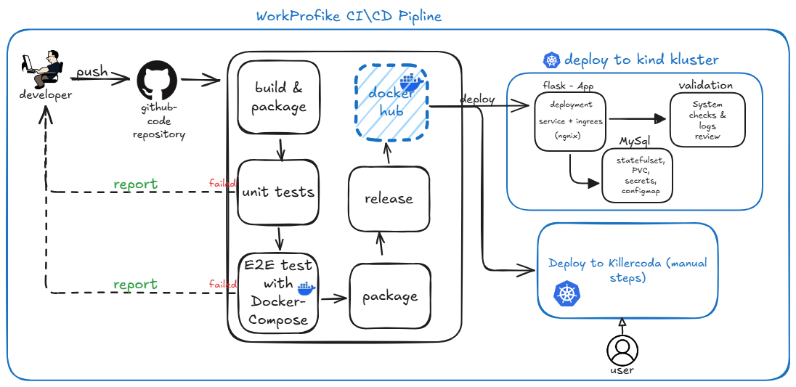
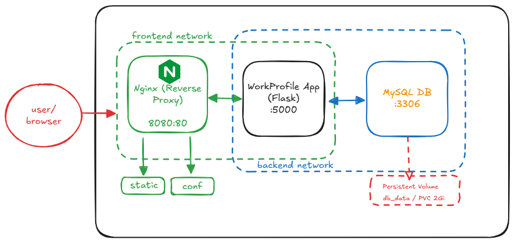
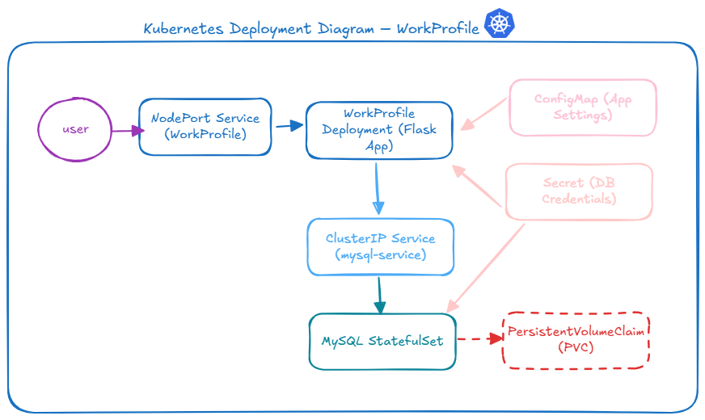
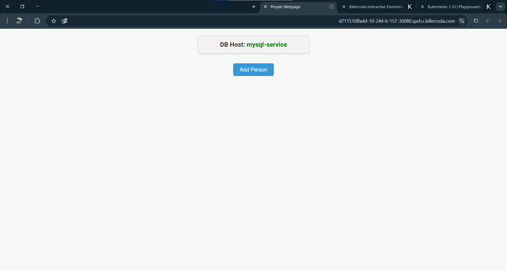
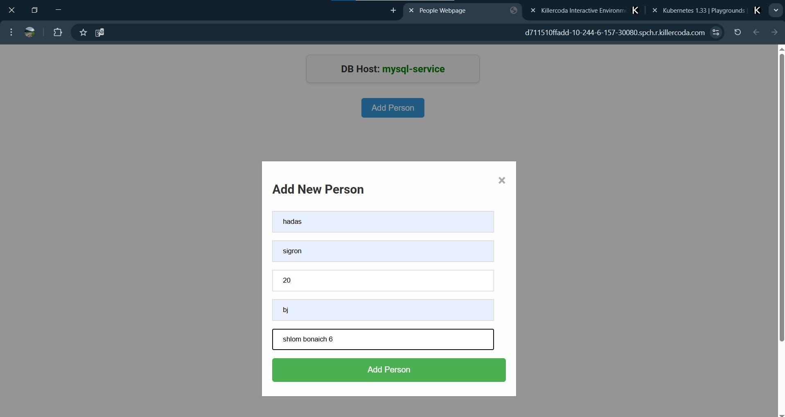
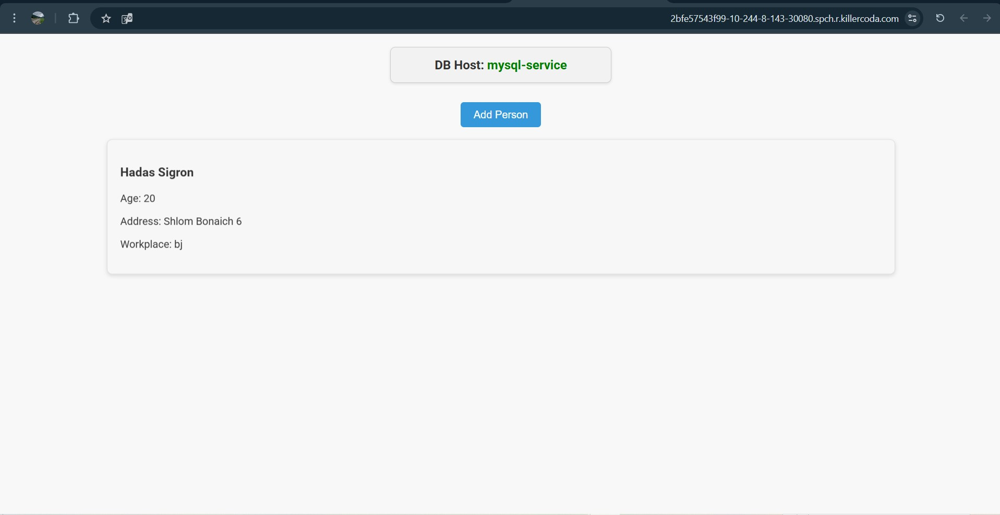

# WorkProfile Application

## Overview

WorkProfile is a production-ready multi-tier web application built with
**Flask** and **MySQL**.  
It is designed for deployment on **Kubernetes** with a full **CI/CD
pipeline** using GitHub Actions.  
The project supports both local development (via Docker Compose) and
cloud-native deployment.

---

## CI/CD Pipeline

The CI/CD process ensures that every change goes through testing, image building, and automated deployment:

- **build-test**: Runs linting + unit tests, builds Docker image, generates semantic tag.  
- **e2e-tests**: Runs integration tests using Docker Compose (full stack with Nginx + Flask + MySQL).  
- **push-image**: Pushes Docker image to the container registry.  
- **deploy-k8s**: Deploys MySQL + WorkProfile on Kubernetes, validates health checks, ensures readiness.



---

## Architecture in Context

When code passes CI/CD, the application can be deployed either locally with **Docker Compose** or on a **Kubernetes cluster**.

### Docker Compose (local development)



- Runs **Nginx + Flask app + MySQL** locally.
- Good for development and E2E testing.
- Accessible at [http://localhost:8080](http://localhost:8080).

### Kubernetes (production-like)



- MySQL runs as a **StatefulSet** with persistent volume claims (PVC).
- WorkProfile runs as a **Deployment** with readiness & liveness probes.
- Services expose MySQL internally and WorkProfile externally (NodePort, e.g. `30080`).
- Configurations via ConfigMaps and credentials via Secrets.

---

## Application Screenshots

Below are example screenshots of the WorkProfile application in action:

  
  
  

---

## Running Locally with Docker Compose

```bash
# Clone the repository
git clone https://github.com/HadasSigron/WorkProfile.git
cd WorkProfile

# Start the stack (Nginx + Flask + MySQL)
docker-compose -f docker-compose/docker-compose.yml up -d --build

# Access the app
http://localhost:8080/
```

---

## Deployment on Kubernetes (Killercoda or local cluster)

```bash
# Create namespace
kubectl create namespace workprofile

# MySQL secrets + init.sql
kubectl -n workprofile apply -f k8s/mysql-secret.yaml
kubectl -n workprofile create configmap mysql-initdb-config   --from-file=init.sql=init.sql   -o yaml --dry-run=client | kubectl apply -n workprofile -f -

# MySQL StatefulSet + Services
kubectl -n workprofile apply -f k8s/mysql-statefulset.yaml
kubectl -n workprofile apply -f k8s/mysql-service.yaml
kubectl -n workprofile rollout status statefulset/mysql --timeout=360s

# WorkProfile application (ConfigMap + Deployment + Service)
kubectl -n workprofile apply -f k8s/workprofile-configmap.yaml
kubectl -n workprofile apply -f k8s/workprofile-deployment.yaml
kubectl -n workprofile apply -f k8s/workprofile-service.yaml
kubectl -n workprofile rollout status deployment/workprofile --timeout=300s

# Get NodePort and access via Killercoda Traffic Port (e.g., 30080)
kubectl -n workprofile get svc workprofile-service
```

---

## Notes

- Secrets are managed securely with Kubernetes Secrets.  
- Configurations are stored in ConfigMaps.  
- Health probes (liveness & readiness) ensure reliability.  
- Resource limits provide predictable scaling.  

---

## Contribution

Contributions are welcome! Please open issues or submit pull requests on GitHub.
